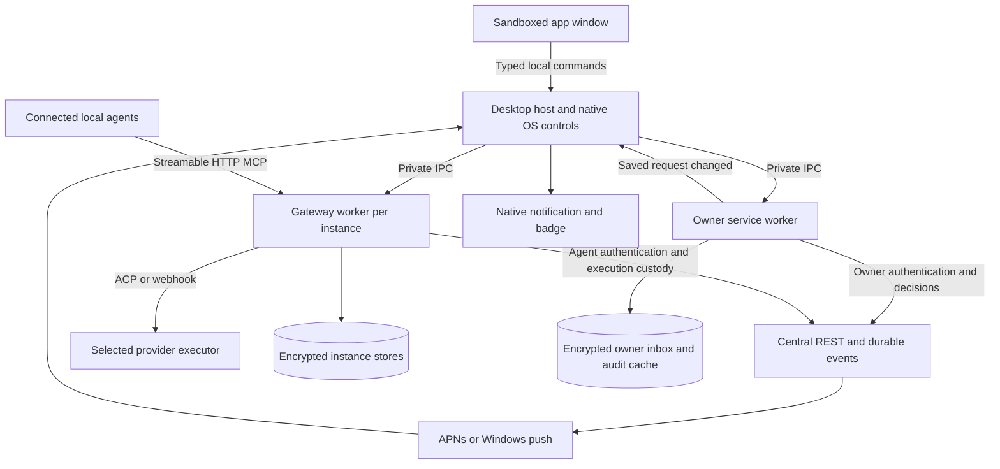

# Embassys desktop app

Status: accepted for implementation under [ADR 0064](adr/0064-desktop-application.md).

Date: 2026-09-07. Companion: [implementation and test plan](desktop-app-plan.md).

## Recommendation

Build a desktop app that lives in the macOS menu bar or Windows/Linux tray,
with a proper window for requests, conversations, permissions and settings.
Launching Embassys starts its server in the background. Closing its window keeps
it running; **Quit Embassys** stops it. Users sign in, connect their agents,
answer questions and manage the server without opening a terminal.

Reuse the existing TypeScript gateway and its durable workflow engine. Put the
desktop interface and owner account controls around it, with separate process
boundaries. Do not build a second implementation of permission matching,
message custody, ACP execution or result delivery.

Recommend Electron for the desktop shell, subject to approval and a packaging
prototype. Bundle a supported Node runtime for the gateway instead of requiring
users to install Node or download dependencies at launch. Use native menus,
notifications and dialogs, with a restrained, accessible interface in the main
window. This is a native desktop experience with a web-rendered content area;
it does not make every control an operating-system widget.

The complete product needs central API changes. In particular, agent email
registration is not returning-user login, an agent credential must not authorize
the owner's decisions, and a push notification must not be the only copy of a
request. The deployed owner account API supplies part of this boundary;
recoverable decisions and event delivery are still needed before a production release.

The user approved an interim development flow under
[ADR 0065](adr/0065-desktop-development-registration.md). First-time registration
now uses an app form and a fixed executor choice. The app can read agent-scoped
permissions and local work, and show optional OS notifications for locally
observed events. These features use the existing agent API.
[ADR 0068](adr/0068-desktop-owner-account-views.md) adds returning-owner sign-in
and read-only requests, permissions and central message snapshots through the
deployed owner API. The owner session has separate encrypted custody in a bundled
Node worker. Signing out leaves local servers running because the API has no
executor binding to revoke. App decisions, complete owner history, local identity
recovery, revocation controls and remote push still depend on the contracts below.

## Scope and proposed changes to the current target

The user approved this design and implementation on 2026-09-07. ADR 0064 records
the amendments below. API implementation remains issue-only in this repository;
the public CLI and release authorization remain separate.

| Existing boundary | Proposed desktop boundary |
| --- | --- |
| GUI work is outside scope | Embassys replaces the CLI experience and reuses its gateway core |
| Registration chooses delivery from MCP client identity | App sign-in and explicit owner selection choose a reviewed executor; agent tool calls cannot change it |
| One default state directory and port | Isolated named instances, each with its own port, data, identity binding and engine version |
| Human decisions happen through email | Owner-authenticated app decisions and email use one central decision transaction |
| Provider history stays with the provider | Retain an encrypted archive of visible Ambassador-managed conversation content from the desktop cutover onward |
| No state migration | Fresh app-owned instances; no CLI import or migration; incompatible state versions are refused |
| No installation/publication tooling changes | Signed desktop installers, bounded agent setup helpers and an update workflow |

Keep exact action schemas, explicit outbound intent, no replay of uncertain
mutations, fixed provider launch commands, independent reception, owner/provider
credential separation and mandatory secret redaction. App approval is for the
pending operation only. It never becomes an instruction to invent another action.

## What the user sees

### Menu and main window

The tray menu contains the active instance name, connection state, number of
items needing attention, **Open Embassys**, **Start/Stop server**, and **Quit**.
Put Clean in Settings, away from everyday controls. With several instances,
show each one's state in the menu and make the selected instance explicit.

The main window uses a sidebar and a list/detail layout. Open Attention by
default when something needs a decision; otherwise restore the last screen.

| View | Contents and primary actions |
| --- | --- |
| Attention | Pending permissions, owner questions and provider-tool approvals. Review, choose an exact offered option, or submit an answer |
| Conversations | People/requesters on the left; their sessions and request timeline on the right. Search, filter, open conversation, inspect a result |
| Permissions | Access I granted / Access granted to me; active, denied, expired and revoked states; scope, expiry, use limit and audit history |
| Agents | Installed/detected clients, setup guidance, Connect, Test connection, Repair and Disconnect; one selected incoming executor per instance |
| Diagnostics | Runtime health, recent errors, logs, correlated request details and a reviewed support export |
| Settings | Account/devices, notifications, launch at login, instances, storage, privacy, updates, stop and clean |

Avoid a dashboard full of counts. A request detail should answer: who wants what,
why, what data or tool is involved, what access would be granted, and what happens
after the user responds. Show readable summaries first, with technical IDs and
formatted JSON behind Details. Never hide the exact scope behind a summary.

Example Attention card, using synthetic data:

```text
Alex's agent wants to check your availability
Tomorrow, 2:00–4:00 PM · Europe/London
Reason: Find a time for your 30-minute catch-up
Access: Free/busy information, without event titles

[Review request]
```

The review screen renders the options supplied by the relevant authority. An
Ambassador resource permission, a provider-tool approval and a question are
distinct card types. Do not turn them all into a generic Approve button. Show
the provider's exact option labels and pass its option IDs unchanged.

### Visual and interaction quality

Use system fonts, native window controls and platform keyboard conventions.
Keep spacing consistent, use one accent color, support light/dark themes and
high contrast, and avoid raw protocol banners in conversations. Requests need
text labels as well as color. Preserve scroll position while new events arrive;
offer a New messages control instead of moving the reader unexpectedly.

The Electron content area uses web components; it is not an AppKit or WinUI
widget tree. The current implementation gives macOS compact push buttons and a
keyboard-operated segmented appearance selector, Windows larger controls with
its field treatment, and Linux neutral desktop controls. Native window chrome,
file dialogs and macOS menus remain OS-provided. Read the system accent through
Electron's [system preferences API](https://www.electronjs.org/docs/latest/api/system-preferences),
with an opaque fallback where unavailable. Keep button labels and accent links
at least 4.5:1 against their normal backgrounds. Refresh on appearance changes
and window focus. This does not promise to copy every Linux desktop theme.

A UI drawn through platform widget frameworks would require a separate toolkit
prototype and explicit dependency approval. No new toolkit is selected for this
refinement; the approved Electron host and bundled server remain in place.

Support keyboard-only operation, screen readers, text zoom, reduced motion,
local date/time formatting and explicit timezones for calendar requests. Test
small windows, long email addresses, right-to-left text and high-density displays.
An empty inbox, loading history, unavailable provider and disconnected server
must each have a useful explanation and next action.

Linux tray support varies by desktop environment. The normal application
launcher and main window must remain usable when no tray is available. Do not
make an invisible background process the only way to reach the app. Electron
documents platform-specific tray behavior in its [Tray API](https://www.electronjs.org/docs/latest/api/tray).

## Sign-in, identity and agent setup

### Three identities, three responsibilities

| Identity | Purpose |
| --- | --- |
| Owner account | The human who signs in and can decide permissions, answer questions and manage devices |
| Agent identity | The central principal used for action execution and existing grants |
| Device/instance | This installation and local executor, with its own key and explicit binding to an agent identity |

An owner's email can have several devices. Do not create a replacement central
agent every time they sign in, upgrade or recover credentials. Existing grants
remain attached to their actual principal IDs unless central explicitly migrates
them. Initially permit one active execution device per agent identity. Other
devices can inspect and decide owner requests without competing for execution.
Concurrent independent versions should normally use separate test identities.

### First launch

1. Start the local application services. Show **Setup needed**, rather than
   Online, until enrollment, central connection and the executor are ready.
2. Enter email, receive a six-digit code, verify in the app. Generate keys locally.
   Central returns a device-bound owner session and the owner's agent identities.
   Create or select the agent identity through the same onboarding flow.
3. Choose the incoming executor from detected, reviewed providers. Explain that
   it will handle requests sent to the user's agent. Providers keep their own
   login, subscription and tool permissions.
4. Choose which installed clients should be able to use Ambassador. These can
   differ from the incoming executor. Connect and verify each selected client.
5. Offer notifications and launch at login with a clear explanation. Show a
   harmless connection check; require an explicit action for a test email or
   agent execution that could incur usage.

Signing in may finish before an executor is installed. The app can then show
owner requests, but the agent must be marked unavailable for execution. Preserve
queued work centrally until a qualified executor is ready. Do not dispatch it
to whichever client happened to connect last.

Expired code, resend cooldown, wrong code, email delivery failure, offline
verification, lost verification response, expired session and revoked device
are separate states. Never suggest Clean as the routine recovery for sign-in.

Embassys creates fresh app-owned state. There is no CLI import, credential
transfer or migration flow. Leave existing CLI and older development-app files
untouched. Recovering an already registered email without local credentials
requires central's owner recovery contract; never use Clean to create a replacement
identity or copy a live database.

### Connection buttons

A connection adapter is compiled into the app and reviewed for a specific
provider and configuration scope. It can detect an installation, prepare a
change, apply it, verify it and undo its own change. It cannot accept a command
or file path supplied by a remote agent.

| Client | Proposed Connect behavior | Qualification limit |
| --- | --- | --- |
| Codex local clients | Use the supported MCP setup command or preserve and edit the selected MCP configuration entry; set the held-call timeout; guide reload | Measure the actual desktop connection and first-turn discovery |
| Claude Code, including desktop Code | Use the supported MCP setup command with explicit scope; preserve other servers; guide reload | Claude Chat/Cowork is a different client |
| OpenClaw | Add the Ambassador entry through its reviewed configuration path; validate before applying; ask before restarting its gateway | Native return stays opt-in and experimental |
| Hermes | Use its supported MCP setup/configuration path and timeout; guide session/gateway reload | Native return and webhook history limitations remain visible |
| Standalone Claude Chat/Cowork and other clients | Show guidance only until the exact transport and installed-client behavior pass qualification | Cloud-hosted connectors cannot assume access to this computer's loopback port |

Prefer provider-supported setup commands. If a scoped file edit is necessary,
validate the file and check for concurrent changes, preserve unrelated entries
and formatting, then write atomically. Keep only the previous Ambassador entry
or an encrypted bounded undo record; do not copy unrelated credentials into a
backup. Disconnect removes only the entry the app owns. A policy-managed or
unknown configuration gets guidance, not a forced edit. An app does not need to
own or inspect a provider's login to configure its MCP endpoint.

Distinguish **Configured**, **Client connected** and **Executor tested**. A
successful file write or a health response does not mean the model has the tools.
Retain manual setup instructions alongside the button. Do not make automatic
installation of the agent itself part of Connect.

The proposed helpers follow [Codex MCP configuration](https://learn.chatgpt.com/docs/extend/mcp?surface=cli),
[Claude Code MCP configuration](https://code.claude.com/docs/en/mcp),
[OpenClaw MCP configuration](https://docs.openclaw.ai/tools/mcp) and
[Hermes MCP configuration](https://hermes-agent.nousresearch.com/docs/user-guide/features/mcp/).
Each adapter still needs installed-version tests before being enabled.

Keep separate capability flags for configuration, incoming execution, history
reading, provider-history deletion and original-chat return. A provider may pass
one and fail another. The app can show an owner question without the provider
supporting native chat return, but it cannot manufacture that provider's transcript
or promise to wake its original conversation. Qualify each capability per OS.

## Runtime architecture



The diagram shows roles. Use a separate owner service worker and one gateway
worker per active instance. Both use the bundled Node runtime. The owner worker
holds owner-scoped sessions and the app's durable inbox cache; the gateway holds
only its agent execution credential. Neither renderer nor provider gets an
owner token. One gateway worker owns all databases and delivery for its instance.
Keep its central reception independent from model execution as it is today.

The owner event subscription and the gateway's execution receiver have different
server-side audiences and delivery cursors. They must never race to consume the
same mailbox. All owner windows share one local owner subscription. A desktop
notification observes saved events; it does not start another poller.

### Framework choice

| Option | Benefit | Cost and decision |
| --- | --- | --- |
| Electron with bundled Node gateway | Reuses TypeScript expertise and core, consistent renderer, mature desktop APIs | Larger download and idle footprint; recommended pending measurements |
| Tauri with Node sidecar | Uses platform webviews; plausible smaller shell | Still needs the Node engine plus Rust/native integration and cross-webview testing; retain as an alternative |
| Separate native apps | Closest platform control behavior | Three UI implementations and integration paths; excessive initial maintenance |

Electron supports separate application processes and native desktop controls.
The recommendation is an engineering judgment based on this repository's
existing TypeScript engine, rather than a claim that Electron is inherently
more reliable. See its [process model](https://www.electronjs.org/docs/latest/tutorial/process-model).
Tauri explicitly supports [bundled sidecars](https://v2.tauri.app/develop/sidecar/),
so it remains viable if the Electron prototype fails the agreed resource budget.

Package a fixed Node build compatible with the gateway's current minimum and
native SQLite module, together with the exact engine and adapter artifacts.
The gateway's `process.execPath` must resolve to that Node runtime when launching
bundled adapters. Do not assume the Electron executable is a drop-in Node binary.
Electron utility processes are an alternative only after proving adapter launch,
Node feature support and SQLite ABI compatibility. Native modules require
runtime-specific builds, as described in [Electron's native module guidance](https://www.electronjs.org/docs/latest/tutorial/using-native-node-modules).

Recommend a small TypeScript component UI, with React and accessible primitives
as candidates for approval. Choose exact UI, installer, update and test packages
in the prototype ADR. No framework or dependency is selected for installation by
this document.

### Private control boundary

The window receives a narrow API through a preload bridge. Commands include
listing requests, loading a conversation page, reviewing/submitting a decision,
connecting an agent, starting/stopping an instance and preparing a clean. Do not
expose raw IPC, filesystem access, arbitrary SQL, arbitrary URLs or shell execution.

Validate IPC sender/frame, command schema, instance identity, pagination and
payload sizes. Host-to-worker channels are private inherited pipes with an
explicit protocol/version handshake and process lifetime binding. Credentials
never enter command lines or logs. A stale window cannot submit a decision for
another account after sign-out or instance switching.

Keep `/mcp` as the agent channel, with current loopback Host/Origin checks and
no owner/admin methods. Do not add a browser-accessible approval endpoint there.
The existing private CLI route can retain its limited authenticated operations;
the desktop IPC contract is separate. Owner sign-in and permission-decision
capabilities are never returned in the MCP catalog.

Load packaged UI assets only; disable Node integration in the renderer, enable
context isolation and sandboxing, enforce a restrictive CSP, block navigation
and new windows, and open validated external links in the system browser.
Render remote prompts, Markdown and JSON as untrusted content, without executable
HTML or automatic remote images. These follow [Electron's security guidance](https://www.electronjs.org/docs/latest/tutorial/security).
Local code running as the same OS user remains inside the existing machine
trust boundary; separate credentials do not establish proof of human presence.

### Lifecycle

| User/system event | Behavior |
| --- | --- |
| Launch | Start previously enabled instances unless explicitly stopped; restore UI and reconnect from saved cursors |
| Close window | Keep host, owner subscription and running gateway in the tray; release unnecessary renderer resources |
| Stop server | Gracefully stop that instance's MCP listener, execution receiver and ACP work; preserve state; owner inbox can still receive updates |
| Quit | Stop all app-owned gateway workers and owner subscription; no hidden execution service remains |
| Launch at login | Opt-in per-user startup; no root/admin system daemon; respect disabled instances |
| Sleep/network change | Do not prevent sleep; reconnect and reconcile on wake; never assume the connection survived |
| Renderer crash | Gateway continues; recreate the view from saved state |
| Gateway crash | Report interruption, restart with capped backoff, replay only prepared local work; uncertain external work stays uncertain |
| Host death | Child channels close and workers shut down within a bounded deadline; prove no orphan ACP process retains the instance |

An intentional stop is a persisted choice and must not trigger the crash
supervisor. Start and Clean identify the exact instance through authenticated
control and lock ownership. If another Ambassador owns it, offer a named stop
confirmation; never stop an unrelated process just because it holds the port.

Historical local reads while the gateway is stopped must use a bounded read mode
under the same instance lock. Do not let the owner worker open gateway databases
behind an active gateway's back. Provider history loading can wait until the
executor is available; displaying cached content must not launch an agent.

## Conversations, history and audit

Group incoming work by central-issued requester identity within the local
instance and executor scope. Display the person's verified email/name, and keep
separate provider sessions beneath that group when the executor or workspace
changes. Do not merge identities based only on a display name or reused email.

Each conversation has two views:

- **Activity** shows requests, permission decisions, owner questions, execution
  status and exact results. It is derived from durable workflow records.
- **Conversation** shows visible user/agent content and expandable tool events
  from Ambassador-managed provider sessions, with source and timestamps.

The model's reasoning/thought events are not conversation content. Do not save
them. Do not ingest arbitrary provider files, full desktop accounts or unrelated
chats. The original chat where a user called MCP is not automatically the same
as the incoming ACP session. Offer **Open in agent** only for a verified provider
link; a native return acknowledgement does not prove that chat was displayed.

Current `sessions show` loads provider history and returns a bounded preview.
It cannot supply a complete permanent archive. To meet the new requirement,
capture visible ACP events going forward in a separate encrypted transcript
store. Normalize streaming chunks into entries; retain source IDs/sequence and
label partial, compacted, truncated or unavailable content. Provider replay must
not duplicate already captured entries. If stable IDs are unavailable, keep an
explicitly labelled replay snapshot rather than guessing a cross-run merge.

Old sessions are best-effort provider reads, with clear completeness labels.
Webhook providers do not expose all conversation text through delivery HTTP
responses. Require a qualified history adapter for that view; otherwise show
Activity and explain why Conversation is unavailable. This is particularly
relevant to Hermes webhook sessions.

Keep workflow custody, transcript retention, approval audit, log rotation and
UI read state separate. Opening a conversation or notification must not consume
an agent's unread result. A user acknowledgement in the app is recorded as its
own viewer receipt; the existing agent receipt remains independent.

Proposed defaults for review: retain visible conversation bodies for 30 days
with a 1 GiB encrypted per-instance cap, and settled activity/audit cache for
90 days. Never evict unresolved workflow custody to make room for history.
At the history limit, prune eligible settled content and mark gaps; otherwise
pause archival with a visible notice. Central supplies authoritative decision
history beyond the local cache. Support export and deletion of local history,
clearly separate from deleting provider history or revoking access.

Show exact results with action-specific layouts only when the catalog has a
published result schema. Until then use readable generic fields plus JSON. Do
not recreate the permission/action name mapping bug through UI templates.

## Notifications and owner decisions

### Delivery that works while the app is running

Central publishes a durable owner event for a pending permission, question,
decision or result. The owner worker receives it, commits it locally, updates
the inbox, and asks the host to display a native notification. Use one
authenticated resumable SSE connection per owner/device while running. An HTTP
client in the worker sends authentication headers; tokens never go in URLs.

This central SSE feed is distinct from MCP Streamable HTTP SSE. The former
updates the owner's app; the latter supports an agent's open tool call. Neither
format alone supplies persistence, replay, approval authority or model wake-up.
Keep REST for mutations. A WebSocket adds little to this one-way event flow.

Use a cursor-based snapshot/catch-up contract with stable event IDs, explicit
retention gaps, duplicate handling and bounded backoff with jitter. An expired
cursor triggers a consistent snapshot plus a new cursor. Never silently skip
the gap. The server must publish events after the business transaction commits,
using a transactional outbox. Push, SSE and email observe the same saved request.
Bound connection lifetimes to authentication validity, reconnect after refresh,
and close subscriptions on device revocation. Queue overflow is an explicit
catch-up condition. UI subscriptions cannot apply backpressure to gateway custody.

### Native remote push

Remote push is a second route for notifying the OS when there is no active app
connection. It is a wake-up or attention hint, not a durable message queue and
not permission to execute an action.

| Platform | Running app | No active app connection |
| --- | --- | --- |
| macOS | Durable feed plus native notifications | APNs with signed app identity/entitlements and device registration; separately qualify closed-app activation |
| Windows | Durable feed plus native notifications | WNS/Windows App SDK integration with package identity and activation requirements; separately qualify packaged delivery |
| Linux | Durable feed plus desktop notifications | No universal remote-push/closed-app promise in the target; rely on running tray app, optional login startup and email fallback |

Electron exposes an [APNs integration](https://www.electronjs.org/docs/latest/api/push-notifications)
for macOS, including an event documented for a running app. That does not prove
quit-state behavior for our signed package. Windows background push needs its
own native integration and packaging qualification, described in Microsoft's
[push quickstart](https://learn.microsoft.com/en-us/windows/apps/develop/notifications/push-notifications/push-quickstart).
Linux's [desktop notification protocol](https://specifications.freedesktop.org/notification/latest/basic-design.html)
is a session-bus display protocol, not a cloud delivery service.

Do not promise notifications while a computer is powered off, has no network,
or the OS suppresses delivery. On return, the inbox catches up regardless.
An explicit Quit never authorizes restarting background agent execution; an OS
notification may open the app when the user clicks it.

Notification payloads contain a device/account reference, event ID, type and
expiry, with generic text by default. No approval tokens, personal answers or
arbitrary URLs. Clicking opens the relevant request, authenticates if needed,
and fetches its latest state before enabling a decision. First release uses
**Review**, not approval buttons on the lock screen. Respect Do Not Disturb,
notification denial, per-category preferences and deduplication across feed/push.
Group noisy status updates; prioritize items needing a human.

Central sends to registered devices, rotates tokens, removes invalid endpoints,
expires old notifications and coalesces superseded events. APNs/WNS acceptance
is not a display receipt. A notification click is not a permission decision.

### One decision, even across several channels

The app posts an owner-authenticated decision with the exact request ID,
expected revision and a persistent idempotency key. Central verifies ownership,
current status, expiry and offered values, then atomically saves the decision,
invalidates alternative email tokens, appends audit and publishes the event.
An email or another device can win the race; show the existing outcome rather
than overwriting it. A lost response is recovered with the same mutation ID.

Questions and ACP tool approvals preserve their own correlation and lifetime.
A provider-tool choice also binds the active invocation/generation. After a
provider dies or the invocation expires, a stale approval cannot authorize a
replacement process. Structured owner answers use the existing durable
continuation path and resume only the named pending call.

Disable decision submission offline and explain that the request must be
refreshed. A draft text answer may be kept locally, but an offline approval
must never be silently sent later. Revoking a grant affects future authorization;
it does not undo data already shared or cancel an already executed action.

## Multiple instances and different versions

Use an advanced **Instances** section. Each instance has an immutable local UUID,
a display/process label, loopback port, canonical data location, engine version,
release channel, agent identity, executor binding and enabled/stopped state.
Default is one ordinary instance on 8787. Development instances are opt-in and
visually labelled throughout the app and in notifications.

Each instance owns separate credentials, keys, locks, databases, transcripts,
diagnostics and native-route journals. Canonicalize locations and reject shared,
nested, linked or otherwise aliased live state roots. Validate ownership and
filesystem support. Never derive shutdown authority from a process name or PID.
A friendly process name is diagnostic; OS process-list presentation needs
platform testing and is not the instance identifier.

Ports remain loopback-only and stable once configured. Detect conflicts before
changing client configuration. A port change requires that instance to stop,
then updates only its owned client entries, private control address, trusted
Host/Origin values and native bridge binding. Restart and recheck the clients.
Do not select a random replacement silently.

One app can supervise several explicitly installed engine versions when its
private control protocol and schema bounds match. Stable/Beta app installs use
different application IDs, state roots, notification registrations and default
instance names. No package is downloaded or executed merely because an agent
supplied a version string; version acquisition uses a reviewed signed release
manifest and an owner-initiated installation flow.

Version 0.2.19 has no desktop IPC protocol or supported instance selectors.
Do not advertise it as app-managed merely because internal tests can override
its port. Qualify management from the first compatible engine release onward;
older binaries are outside the app-managed version set.

Provider configuration is part of isolation. A background executor for Test
must not load the Production Ambassador endpoint from a global provider config.
Require a reviewed provider profile/project scope that binds the right endpoint
and credentials, and verify it before activation. If the provider cannot isolate
the two configurations, reject that simultaneous executor combination. Listing
two identical Ambassador tools in one agent is not a sufficient isolation plan.

## Storage, diagnostics, clean and updates

The app never stores central tokens, DPoP keys, email codes, cookies or provider
credentials in renderer storage, logs or support exports. Keep the existing
atomic encrypted agent credential/key pair; use separate owner-session custody.
Propose OS-backed wrapping for desktop secrets, subject to a custody ADR and
restart/upgrade tests. Linux must not silently fall back to Electron's documented
`basic_text` backend; detect it and require a usable secret store or an explicitly
designed encrypted fallback. See [safeStorage's platform limits](https://www.electronjs.org/docs/latest/api/safe-storage).

Diagnostics has Basic and Detailed views, filtering by instance, time, peer,
operation and error. Keep the current bounded development body logs and redaction.
Provide **Reveal log folder** and **Export support bundle**, showing the selected
time range and data categories first. Omit credentials and transcript bodies by
default. Do not upload automatically. Production retention and opt-in body
capture require a separate approved policy; the current development approval
does not cover a general production rollout.

**Stop** preserves enrollment and pending work. **Sign out** ends this device's
owner session and disables its execution binding; it is not account deletion.
**Clean local instance** shows its identity and unresolved work count, stops the
exact instance, acquires its lock and removes its local enrollment and workflow
state. Preserve logs under the existing policy and explain that clearly. Never
delete central registration, provider configuration or provider history as a
side effect. A separate cleanup action can remove retained diagnostics.

Before a destructive clean, disclose that unsubmitted local work and locally
held results may be lost even with central recovery. Offer a diagnostic export,
which is not a credential backup or a promise to restore workflows. Clean should
not depend on central being online; stale device/push registration must be
reconciled through owner device management after reconnect.

Sign installers and updates, notarize macOS builds, qualify the selected Windows
packaging, and support a defined Linux distribution/desktop matrix. Package the
UI, Node runtime, native SQLite and adapters as a verified unit. Updates never
silently change provider settings or install a new executor.

Download updates in the background, but install after work drains or the owner
accepts a clearly described interruption. Persist current custody before stopping.
Keep the previous application artifact for rollback; do not run it against a newer
database schema unless that combination is explicitly supported. Refuse
incompatible state versions. Schema migration is outside this scope; qualify
interruption and artifact rollback before enabling automatic updates. No unconditional
application/schema downgrade button.

## Central API requirements

Reviewed central `main.py` at revision
[`708f205bfaee5010eb86fcfae55967fb5d02071c`](https://github.com/embassys/agent2agent/blob/708f205bfaee5010eb86fcfae55967fb5d02071c/main.py)
on 2026-09-07, plus local enrollment, registration, session and gateway code.
This was a read-only source review, not a new deployed qualification run.

The server currently has agent registration/verification, agent-scoped permission
listing and polling. Its permission and human-input JSON decision routes require
the emailed one-use token. `get_human_input_status` can read a known question for
the calling agent; it does not provide an owner inbox or returning-user login.
Legacy agent decision routes are not an acceptable substitute for human authority.

The table describes proposed contracts, not deployed routes. Names and schemas
must be agreed with the API repository before the app calls them.

| ID | Contract needed | Required behavior | Priority and existing issue |
| --- | --- | --- | --- |
| D1 | Owner email challenge, verification, session refresh and sign-out | New/returning owner, bounded single-use codes and retries, device-key binding, lost-response recovery, refresh rotation/revocation, agent IDs returned without replacement | Blocks complete sign-in; [issue 7](https://github.com/embassys/agent2agent/issues/7), with recovery in issue 2 |
| D2 | Devices, agent ownership and execution binding | List/add/revoke devices; select/create an owned agent; one active executor per identity with server-enforced fencing; explicit recovery/transfer with existing grants preserved | Blocks safe recovery and same-account devices; [issue 7](https://github.com/embassys/agent2agent/issues/7) |
| D3 | Owner inbox and decision/input commands | Paginated pending items and detail; owner authentication; exact choices, scopes and expiry; revision-checked idempotent decisions; shared transaction with email; provider invocation expiry | Blocks in-app permission decisions; [issue 8](https://github.com/embassys/agent2agent/issues/8) |
| D4 | Recoverable event feed and execution delivery | Transactional outbox, stable IDs, bounded pages, per-audience/device cursors, snapshot watermark and gap recovery; execution lease/capture acknowledgement distinct from observation | Production reliability gate; [issues 1](https://github.com/embassys/agent2agent/issues/1) and [3](https://github.com/embassys/agent2agent/issues/3) |
| D5 | Submission idempotency and outcome lookup | Request ID plus body fingerprint, queryable accepted outcome, conflict on different body, all action/decision/input mutations covered | Production reliability gate; [issue 4](https://github.com/embassys/agent2agent/issues/4) |
| D6 | Permission audit, revocation and current state | Paginated grants/history, grantor/grantee direction, actor/source, scope, expiry/use limits, current revision, authoritative revoke; no claim to undo completed work | Blocks complete Permissions screen; [issue 9](https://github.com/embassys/agent2agent/issues/9) |
| D7 | Device push registration and dispatch | Owner-authorized device endpoints, token rotation/removal, preferences, minimal payloads, expiry/coalescing, replay-safe routing, delivery metrics without false display claims | Blocks APNs/WNS delivery; [issue 10](https://github.com/embassys/agent2agent/issues/10) |
| D8 | Action results and progress | Catalog result schemas; correlated waiting-for-owner/running/result states with timestamps; owner questions do not expose private answers to the requester | [Issues 5](https://github.com/embassys/agent2agent/issues/5) and [6](https://github.com/embassys/agent2agent/issues/6) |

Minimum owner request detail includes request ID and kind, owner/agent/peer IDs,
verified display identity, action and exact scope, reason, original call/message
correlation, allowed options or input schema, revision, creation/expiry times and
current state. Do not put an emailed bearer token in this resource.

Every event includes event ID, schema version, audience/stream, resource ID and
revision, timestamp, cursor and relevant correlation IDs. Repeated/out-of-order
events must not regress resource state. Decide retention, maximum body sizes,
rate limits and snapshot semantics in the contract. Consumer acknowledgements,
execution fencing and UI read receipts are different operations.

For D1/D3, separate owner and agent token audiences/scopes at the server. A
process authenticated as an agent cannot invoke owner decisions, list owner
device secrets or mint an owner session. Validate this in server tests, not
only by hiding buttons or omitting MCP tools.

No new API implementation is proposed in this repository. First update or open
human-readable API issues from this table, then qualify the deployed contracts
and update fixtures/client documentation together. An early local prototype may
use fixtures, but it must label sign-in, decisions and push as simulated where
the required server support is absent.

## Approval and remaining operational inputs

Recommend Electron plus the bundled Node engine, a tray with a full management
window, close-to-tray/quit-to-stop behavior, and one normal instance with advanced
multi-instance controls. Keep the CLI available for developers without making it
part of normal setup.

The user approved the owner API boundary, visible-conversation archive and the
30-day conversation and 90-day local audit cache defaults. ADR 0067 records
metadata-only production diagnostics with seven-day retention and a 1 GiB cap
per app instance. Real macOS/Windows remote push needs
developer accounts, signing identities and the selected Windows packaging route.
These credentials belong in release infrastructure, never in this document.

The [implementation plan](desktop-app-plan.md) separates local work, API
dependencies, platform qualification and release gates.
