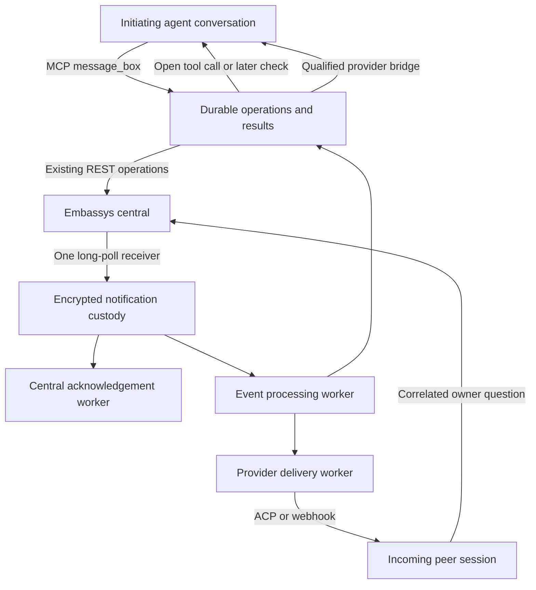

# Product and architecture

Status: accepted target. [Implementation progress](implementation-plan.md) and
[qualification](qualification.md) identify what has been tested.

Embassys Ambassador connects a local agent to the Embassys REST service.
One foreground process owns one enrolled identity and one incoming delivery
profile. Agents use a local MCP tool to request work, check it, supply missing
information and retrieve results. Ambassador owns central reception and durable
workflow state. [ADR 0061](adr/0061-durable-workflows-and-client-delivery.md)
records the approved design.

## Product boundary

The public package is `@embassys/ambassador`; the binary is `ambassador`.
Commands are `start`, `clean`, `webhook-secret`, `sessions list`,
`sessions show <id>`, `sessions delete <id>` and `sessions forget <id>`.
Only start and sessions show accept `--verbose`. Commands cannot select an
agent, executable, mode, endpoint or credential.

Start binds `127.0.0.1:8787` under a singleton process lock. An interactive
start or clean that finds Ambassador running asks whether to stop that exact
authenticated instance and proceed. No is the default. Non-interactive commands
refuse. A confirmed shutdown must release the lock before replacement or cleanup.
An unrelated process occupying the port is never stopped.

Registration resolves the bounded exact MCP client name against reviewed
capabilities. Versions are diagnostic. Unknown or incomplete profiles fail
before local or central enrollment state is created. Direct is the default;
only OpenClaw and Hermes offer a direct/webhook choice. A persisted profile
is authoritative. Provider commands and working directories never come from
tool arguments or remote messages.

## System

Reception, event processing, provider execution and central acknowledgement
run independently. A provider blocked on a human answer cannot block receipt
of that answer. Provider failure preserves uncertain work while reception and
operation updates continue. Accepted notification batches are atomic and
bounded. Persisted dispatch intent prevents replay after an ambiguous crash.

An acknowledged central notification, finished ACP turn, completed action,
accepted client event and displayed answer are separate facts. The system
records each at its own boundary.

## Request, wait and resume

One typed `message_box` handles business operations. Enrollment, catalog
discovery and permission listing remain separate immediate tools. Request an
action using a new UUID, exact catalog action name, target and exact payload.
Ambassador validates the catalog schema, saves intent, requests the exact
permission and dispatches once after a matching grant. Permission-only requests
never create an action. No category/name translation is inferred.

The initial call waits up to 600 seconds for a related event. Each user-driven
check can wait another 600 seconds on the same UUID. Timeout returns a check
continuation and tells the agent the user may ask again. There is no delayed
resubmission. A shorter explicit wait supports constrained clients. Disconnect
ends observation while accepted work continues. Separate wait capacity keeps
ordinary tools available.

Results survive checks, inbox reads, transport disconnects and restart until
explicit receipt. The inbox also includes unanswered calls and outbound status.
Unknown submission outcomes are visible and never automatically repeated.
Saved identifiers can repair local partial state, but the current API cannot
recover an accepted response lost before any identifier was saved.

## Missing owner information

For a pending incoming call, the provider can record `ask_owner` with a question
and exact expected text or button options. Ambassador saves the correlation
before asking central to email its own owner. The background turn may finish.
A matching answer resumes the same peer and call. An answer supplied in the
foreground through `answer_owner` is tied to that question and call. Duplicate
email answers cannot create another continuation.

ACP provider-tool approval is different. The ACP request stays open. Ambassador
sends exact option names and IDs to central and returns the selected ID unchanged.
Menus that cannot fit the API bounds fail explicitly. No automatic approval or
scope mapping occurs. The shared receiver supplies its answer.

## Incoming provider execution

Direct mode is ACP v1 using the approved SDK. Ambassador launches the fixed
OpenClaw, Hermes, Codex or Claude Code invocation without a shell, initializes
the exact expected agent name, and reuses one peer session scoped to enrollment,
provider and canonical working directory. It sends `mcpServers: []`; providers
load their normal tools and authentication. Built-in tools remain enabled.

Provider output is bounded and never parsed as an action result. The provider
must submit structured results through MCP. Unfinished calls keep peer sessions
active; idle sessions become eligible for bounded cleanup after 30 days.
Providers own context compaction and history. Session inspection retains only
bounded recent in-memory previews, not a local transcript copy.

Webhook mode sends the complete validated message using fixed provider formats
and authentication. Hermes uses its reviewed generic webhook and HMAC contract.
OpenClaw uses `/hooks/agent` with a persistent incoming session per enrolled
requester and no announcement, as specified in ADR 0063.
A 2xx confirms receiver acceptance. Central acknowledgement already follows
durable Ambassador custody, independently of provider completion.

## Return to the initiating conversation

Foreground MCP waits work without a native return bridge. Streamable HTTP SSE
keeps supported open responses flowing, but an SSE notification alone cannot
wake an idle model or display a result.

Optional provider extensions capture conversation context in trusted provider
hooks. They observe existing operations and route events through reviewed
provider APIs. They do not create another action, accept a destination from
model input, edit provider history directly, or inspect credentials.

The OpenClaw candidate uses a provider-owned ID-only route journal and
`chat.inject` for the captured logical session key. Its display receipt means
the provider appended and broadcast the message, not that a human read it.
Resetting the same key may create a new history behind that logical conversation.
Ambiguous injection is not repeated; unavailable routes retain unread results.

The experimental Claude Code channel proxy binds its own process conversation.
Channel notifications are accepted events, not display receipts. Hermes stays
on foreground waits until public APIs provide a trusted gateway route and
delivery without interrupting an active turn. Claude Desktop is a separate
qualification candidate, not an alias for Claude Code. See
[client delivery](client-delivery.md) for current evidence and configuration.

## Trust, storage and diagnostics

MCP binds loopback, validates Host and Origin before reading a body, and rejects
Authorization headers. It trusts the owner's local-machine boundary. A separate
private control route rejects every Origin and requires an encrypted internal
secret for bounded session reads and instance-specific stop/status operations.

Central REST uses Bearer authorization plus a P-256 DPoP proof. Enrollment uses
email verification. Central token and private key are one atomic encrypted
credential; wrapping material is generated internally in a separate owner-only
file. Credentials never enter tool arguments, results or logs. Provider
credentials remain entirely with providers.

Encrypted, identity-bound stores hold notification custody, pending calls,
received results, outbound intent, operation events, owner questions and control
answers. Each has a 1 GiB ciphertext quota and bounded records and reads.
Dispatch and receipt records survive restart. New schemas are used directly;
state migration is outside this development cutover.

Development logging captures bounded events and request/response bodies after
credential redaction, even without verbose. Startup prints the diagnostics
directory. Four files of up to 8 MiB rotate; log records cap at 64 KiB.
Clean preserves these logs, and they are never used to recover work. The user
approved retaining these detailed logs for this development release.

Clean deletes local enrollment and workflow state after stopping Ambassador.
It does not delete central registration or provider configuration. Re-enrollment
may create another identity and does not inherit old grants.

## Remaining central limits

The deployed API consumes messages before returning the HTTP response and has
no recoverable lease, idempotent acknowledgement, submission idempotency key or
outcome lookup. Its listener lifecycle also has known liveness gaps. Local
durability begins only after receipt; it cannot promise exactly-once delivery.
Remote waiting-for-owner progress is not currently published to callers.
[API follow-ups](central-follow-ups.md) track these issues. No API code change
is part of this implementation.

GUI development, arbitrary agent commands, general conversations, provider
credential management, central MCP discovery, publication and automatic
installation remain outside scope.
